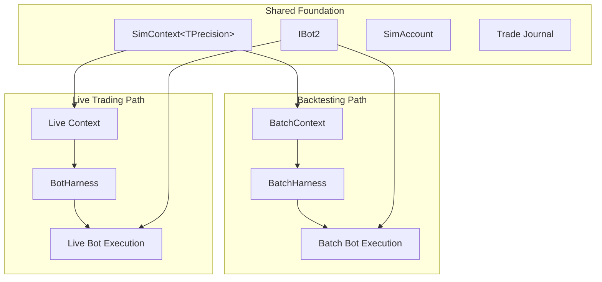
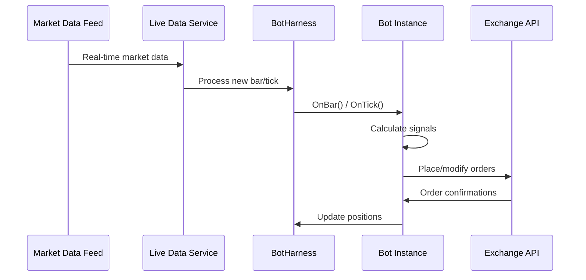
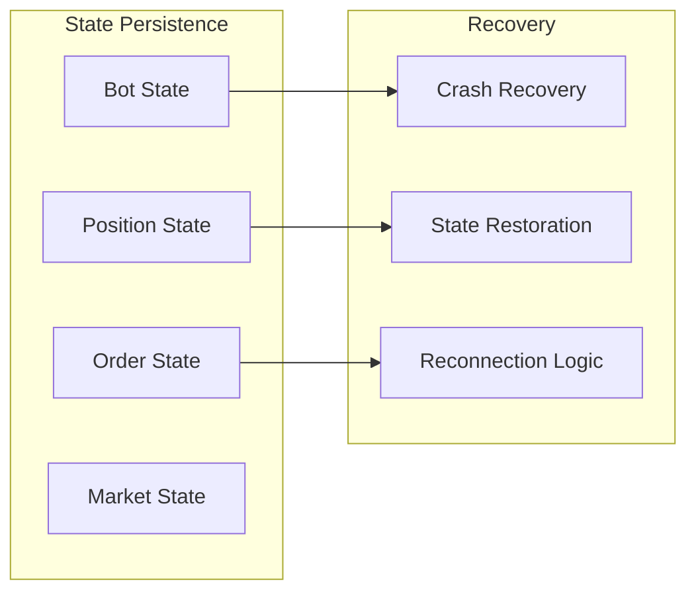

# Live Bot Execution Architecture

## Overview

This document describes the nascent live bot execution system in the LionFire Trading Automation framework. The live bot infrastructure is currently in early development (WIP), building upon the same architectural foundations as the backtesting system but adapted for real-time market data and live trading scenarios.

⚠️ **Note**: The live bot execution system is currently incomplete and under active development. This documentation reflects the intended architecture and current implementation status.

## Architecture Overview

### Design Philosophy

The live bot system follows the same compositional patterns as the backtesting framework, enabling code reuse and consistent behavior between backtesting and live trading:



## Current Implementation Status

### Implemented Components

#### 1. BotHarness<TPrecision>
**Location**: `/src/LionFire.Trading.Automation/Automation/Bots/Execution/BotHarness.cs:17`

```csharp
public sealed class BotHarness<TPrecision> : BotHarnessBase
    , ILiveBotHarness
    , IHasInputMappings
    where TPrecision : struct, INumber<TPrecision>
{
    public IBot2 Bot { get; set; }
    public SimContext<TPrecision> SimContext { get; }
    
    // IHostedService implementation for ASP.NET Core integration
    public async Task StartAsync(CancellationToken cancellationToken)
    {
        InitInputs(); // Initialize live inputs before starting
        await Task.CompletedTask;
    }
}
```

**Key Characteristics**:
- **Single Bot Focus**: Unlike BatchHarness, manages only one bot instance
- **IHostedService Integration**: Integrates with ASP.NET Core hosting for lifecycle management
- **Live Input Support**: Designed to handle real-time data feeds (implementation pending)

#### 2. BotRunner
**Location**: `/src/LionFire.Trading.Automation/Automation/Bots/Execution/BotRunner.cs:9`

```csharp
public class BotRunner : Runner<BotEntity, BotRunner>, IRunner<BotEntity>
{
    protected override ValueTask<bool> Start(BotEntity value, Optional<BotEntity> oldValue)
    {
        Logger.LogInformation("Starting bot: {0}", value);
        
        harness = BotHarnessFactory.Create(value);
        stopped = false;
        _ = Task.Run(async () => await Run(value));
        return ValueTask.FromResult(true);
    }
    
    async Task Run(BotEntity botEntity)
    {
        PeriodicTimer pt = new PeriodicTimer(TimeSpan.FromSeconds(5));
        while (!stopped)
        {
            Logger.LogDebug($"{Current.Value.Name}: running.");
            await Task.WhenAny(Task.Delay(1000), stopEvent.WaitOneAsync());
        }
    }
}
```

**Current Functionality**:
- **Entity Management**: Handles BotEntity lifecycle events
- **Configuration Changes**: Supports dynamic reconfiguration (TODO implementation)
- **Health Monitoring**: Basic running state tracking
- **Factory Pattern**: Uses BotHarnessFactory for bot creation

### 3. Core Interfaces

#### ILiveBotHarness
```csharp
public interface ILiveBotHarness : IBotHarness, IHostedService
{
    // Combines bot execution with hosting service lifecycle
}
```

## Intended Architecture

### Live Data Pipeline



### Input System for Live Trading

**Planned Architecture** (not yet implemented):

```csharp
// Intended live input initialization
private void InitInputs()
{
    // TODO: Subscribe to live market data feeds
    foreach (var inputMapping in InputMappings)
    {
        var liveDataSource = grainFactory.GetGrain<ILiveDataSourceGrain>(
            inputMapping.ExchangeSymbolTimeFrame);
        
        // Subscribe to real-time updates
        await liveDataSource.Subscribe(OnMarketDataUpdate);
    }
}

private async Task OnMarketDataUpdate(IMarketData data)
{
    // Update bot inputs with live data
    // Trigger bot execution if conditions met
}
```

### State Management

Unlike backtesting, live bots must maintain persistent state:



## Missing Components (WIP Areas)

### 1. Live Data Integration

**Current Gap**: The `InitInputs()` method in BotHarness is empty:

```csharp
private void InitInputs()
{
    // TODO: Implement live input initialization logic here.
    // This should be similar to MultiBacktestHarness.InitInputs, but adapted for live data sources.
    // For example, subscribe to live market data feeds and wire them to the bot's input properties.
}
```

**Needed Implementation**:
- Orleans grain integration for live data streaming
- WebSocket connections to exchange APIs
- Real-time data transformation and validation
- Latency optimization for high-frequency strategies

### 2. Order Management System

**Current Status**: Not implemented

**Required Components**:
```csharp
public interface ILiveOrderManager
{
    Task<OrderResult> PlaceOrderAsync(OrderRequest request);
    Task<OrderResult> ModifyOrderAsync(string orderId, OrderModification modification);
    Task<OrderResult> CancelOrderAsync(string orderId);
    IObservable<OrderUpdate> OrderUpdates { get; }
}
```

### 3. Position Management

**Current Status**: SimAccount exists but lacks live trading features

**Needed Enhancements**:
- Real-time position synchronization with exchange
- Margin calculation and monitoring
- Risk management integration
- Position reconciliation after disconnections

### 4. Risk Management

**Current Status**: Not implemented for live trading

**Required Features**:
- Real-time exposure monitoring
- Automatic position sizing
- Stop-loss enforcement
- Emergency shutdown procedures

### 5. State Persistence and Recovery

**Current Status**: Not implemented

**Critical Requirements**:
```csharp
public interface IBotStateManager
{
    Task SaveStateAsync(BotState state);
    Task<BotState> LoadStateAsync(string botId);
    Task<bool> RecoverFromCrashAsync(string botId);
}
```

## Development Roadmap

### Phase 1: Foundation (Current)
- ✅ Basic BotHarness structure
- ✅ IHostedService integration
- ✅ BotRunner with entity management
- ⏳ Input mapping framework adaptation

### Phase 2: Data Integration
- ⏳ Live data source abstraction
- ⏳ Orleans grain integration for market data
- ⏳ Real-time input processing
- ⏳ Latency optimization

### Phase 3: Order Management
- ⏳ Exchange API integration
- ⏳ Order lifecycle management
- ⏳ Position synchronization
- ⏳ Error handling and retry logic

### Phase 4: Risk and State Management
- ⏳ Risk management framework
- ⏳ State persistence layer
- ⏳ Crash recovery mechanisms
- ⏳ Performance monitoring

### Phase 5: Production Features
- ⏳ Multi-exchange support
- ⏳ Strategy versioning
- ⏳ A/B testing framework
- ⏳ Advanced monitoring and alerting

## Comparison with Backtesting System

| Aspect | Backtesting | Live Trading |
|--------|------------|--------------|
| **Data Source** | Historical files | Real-time streams |
| **Execution** | Batch processing | Event-driven |
| **State** | Temporary | Persistent |
| **Performance** | Throughput focused | Latency focused |
| **Risk** | Simulated | Real money |
| **Recovery** | Not needed | Critical |
| **Parallelism** | High (1000s of bots) | Low (1-10 bots) |

## Integration Points

### Orleans Grains
```csharp
// Intended integration with distributed system
public interface ILiveBotGrain : IGrainWithStringKey
{
    Task StartAsync(BotConfiguration config);
    Task StopAsync();
    Task<BotStatus> GetStatusAsync();
    Task UpdateConfigurationAsync(BotConfiguration config);
}
```

### ASP.NET Core Hosting
```csharp
// Current hosting integration
public void ConfigureServices(IServiceCollection services)
{
    services.AddHostedService<BotRunner>();
    services.AddSingleton<BotHarnessFactory>();
    services.AddScoped<ILiveBotHarness, BotHarness<double>>();
}
```

### Configuration Management
```csharp
// Intended configuration system
public class LiveBotConfiguration
{
    public string BotId { get; set; }
    public Type BotType { get; set; }
    public ExchangeSymbolTimeFrame PrimarySymbol { get; set; }
    public RiskParameters RiskSettings { get; set; }
    public Dictionary<string, object> BotParameters { get; set; }
}
```

## Testing Strategy

### Current Limitations
- Live trading components difficult to unit test
- No simulation mode for live trading
- Limited integration test infrastructure

### Recommended Approach
```csharp
// Test harness for live bot development
public class LiveBotTestHarness
{
    public static async Task<TestResult> RunLiveBotTest(
        BotConfiguration config,
        TimeSpan duration,
        SimulatedMarketConditions conditions)
    {
        // Create isolated environment for live bot testing
        // Simulate market conditions
        // Verify bot behavior
    }
}
```

## Security Considerations

### API Key Management
- Secure storage of exchange credentials
- Key rotation mechanisms
- Environment-specific configurations

### Network Security
- VPN requirements for production trading
- SSL/TLS enforcement
- Rate limiting and DDoS protection

### Audit Trail
- All trading actions logged
- Compliance reporting
- Regulatory requirements

## Monitoring and Observability

### Metrics (Planned)
```csharp
public class LiveBotMetrics
{
    public Counter OrdersPlaced { get; set; }
    public Histogram OrderLatency { get; set; }
    public Gauge CurrentPositions { get; set; }
    public Gauge UnrealizedPnL { get; set; }
}
```

### Health Checks
```csharp
public class BotHealthCheck : IHealthCheck
{
    public async Task<HealthCheckResult> CheckHealthAsync(HealthCheckContext context)
    {
        // Verify bot connectivity
        // Check position synchronization
        // Validate risk parameters
    }
}
```

## Performance Considerations

### Latency Requirements
- **Order Placement**: < 10ms to exchange
- **Market Data Processing**: < 1ms per update
- **Signal Generation**: < 5ms per calculation

### Resource Management
- **Memory**: Minimize allocations in hot paths
- **CPU**: Optimize signal calculations
- **Network**: Efficient message serialization

## Future Enhancements

### Advanced Features (Post-MVP)
- Machine learning integration
- Multi-timeframe strategies
- Portfolio optimization
- Dynamic parameter adjustment

### Scalability Improvements
- Horizontal bot scaling
- Load balancing across instances
- Distributed state management

## Related Documentation

- [Architecture Critique](analysis/Architecture-Critique.md)
- [Optimization Flow Architecture](Optimization.md)
- Trading Framework Design Principles *(planned)*

---
*Generated by Claude Code Analysis - December 2024*

**Status**: 🚧 **Work in Progress** - This document describes both current implementation and planned architecture for the live bot execution system.