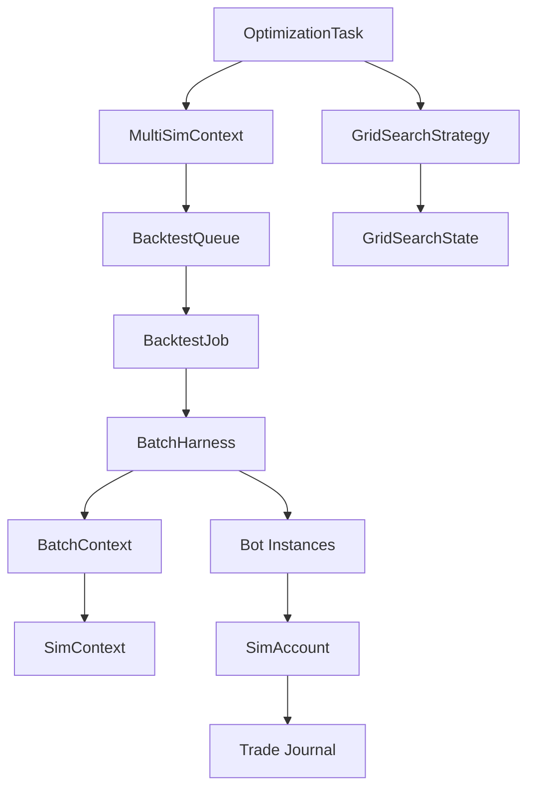
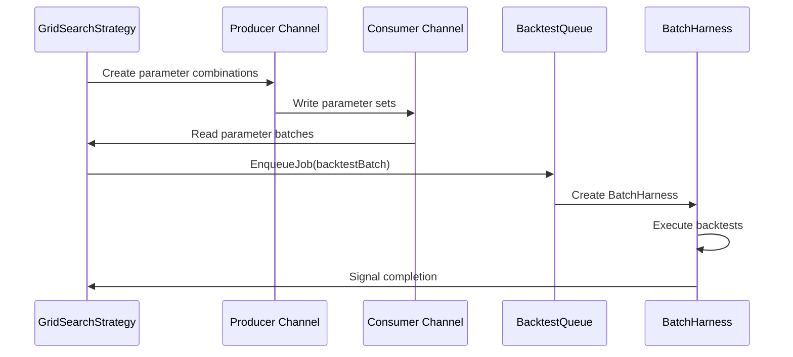
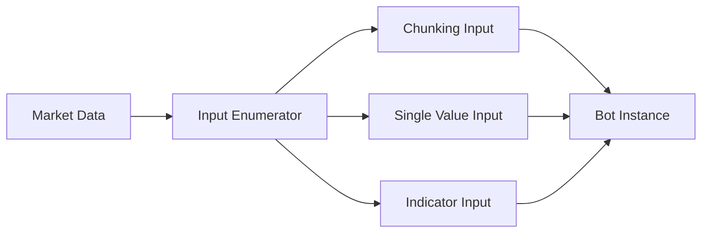
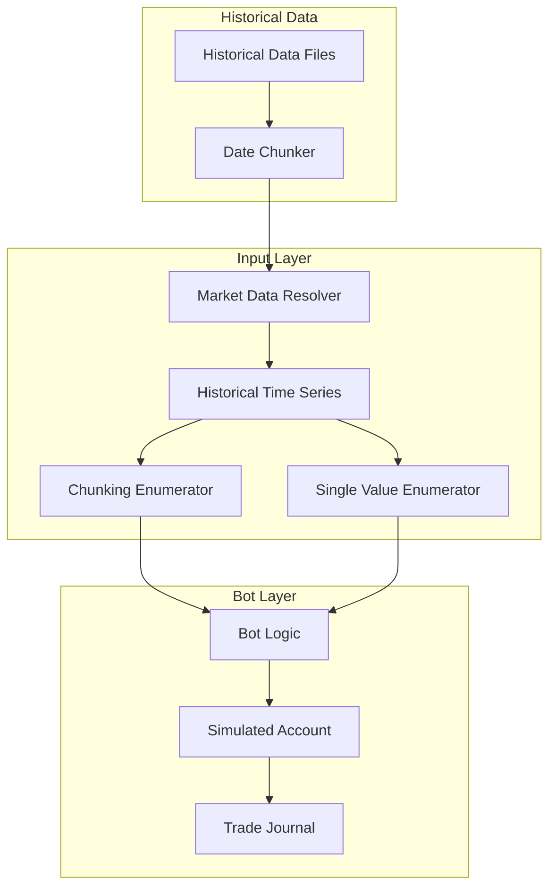
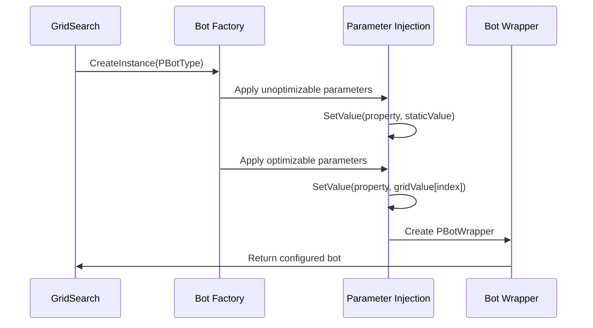

# Optimization Task Execution Architecture

## Overview

This document details the execution flow of optimization tasks in the LionFire Trading Automation framework, tracing the path from optimization initiation through backtest enqueuing, batch execution, and result collection.

## Architecture Components

### Core Classes



## Optimization Execution Flow

### 1. Optimization Task Initialization

**Entry Point**: `OptimizationTask.StartAsync()` - `/src/LionFire.Trading.Automation/Optimization/OptimizationTask.cs:105`

```csharp
public async Task StartAsync(CancellationToken cancellationToken = default)
{
    // 1. Initialize batch context and simulation context
    await BatchContext.Init();
    BatchContext.SimContext.Start(cancellationToken);
    
    // 2. Validate parameters
    Parameters.ValidateOrThrow();
    
    // 3. Setup backtest queue
    BacktestBatcher = ServiceProvider.GetRequiredService<BacktestQueue>();
    
    // 4. Create optimization strategy
    GridSearchStrategy gridSearchStrategy = ActivatorUtilities
        .CreateInstance<GridSearchStrategy>(ServiceProvider, Parameters, this);
    
    // 5. Execute optimization
    RunTask = Task.Run(async () => await gridSearchStrategy.Run());
}
```

**Key Initialization Steps**:
1. **MultiSimContext Creation**: Sets up orchestration context with service dependencies
2. **OptimizationRunInfo Generation**: Creates metadata for the optimization run including bot info, timeframe, machine details
3. **Parameter Validation**: Ensures all required parameters are valid before execution
4. **Strategy Instantiation**: Creates GridSearchStrategy for parameter space exploration

### 2. Grid Search Strategy Execution

**Core Logic**: `GridSearchStrategy.Run()` - `/src/LionFire.Trading.Automation/Optimization/Strategies/GridSearch/GridSearchStrategy.cs:156`



#### Producer Task (Parameter Generation)
**Location**: `GridSearchStrategy.cs:309`

```csharp
var producerTask = Task.Run(async () =>
{
    long remainingBacktestsAllowed = OptimizationParameters.MaxBacktests;
    
    while (State.CurrentLevelIndex <= 0 && remainingBacktestsAllowed > 0)
    {
        foreach (var parameterSet in State.CurrentLevel)
        {
            await ParametersToTest.Writer.WriteAsync(parameterSet, CancellationToken);
            if (--remainingBacktestsAllowed == 0) break;
        }
    }
    ParametersToTest.Writer.Complete();
});
```

**Responsibilities**:
- Enumerate parameter combinations from grid search space
- Respect maximum backtest limits
- Write parameter sets to bounded channel for processing

#### Consumer Task (Backtest Enqueuing)
**Location**: `GridSearchStrategy.cs:184`

```csharp
var enqueueTask = Task.Run(async () =>
{
    while (await ParametersToTest.Reader.WaitToReadAsync())
    {
        List<PBotWrapper> backtestTasksBatch = new(maxBatchSize);
        
        // Create bot instances with parameter combinations
        foreach (var parameterIndices in batchStaging)
        {
            var pBot = Activator.CreateInstance(OptimizationParameters.PBotType);
            
            // Apply unoptimizable parameters
            foreach (var poo in unoptimizableParameters)
            {
                poo.Info.SetValue(pBot, poo.SingleValue ?? poo.DefaultValue);
            }
            
            // Apply optimizable parameters
            int parameterIndex = 0;
            foreach (var kvp in optimizableParameters)
            {
                kvp.Info.SetValue(pBot, State.CurrentLevel.Parameters[parameterIndex]
                    .GetValue(parameterIndices[parameterIndex]));
                parameterIndex++;
            }
            
            backtestTasksBatch.Add(new PBotWrapper { PBot = pBot });
        }
        
        // Enqueue batch for execution
        await batchQueue.EnqueueJob(MultiSimContext, backtestTasksBatch, CancellationToken);
    }
});
```

**Responsibilities**:
- Read parameter combinations from channel
- Instantiate bot parameter objects with specific values
- Group bots into batches for efficient execution
- Enqueue batches to BacktestQueue

### 3. Backtest Queue Management

**Core Class**: `BacktestQueue` - `/src/LionFire.Trading.Automation/Backtesting2/Batching/BacktestQueue.cs:32`

#### Queue Architecture
```csharp
public class BacktestQueue : IHostedService
{
    private Channel<BacktestJob> QueuedJobsChannel;
    ConcurrentQueue<BacktestJob> QueuedJobs;
    ConcurrentDictionary<Guid, BacktestJob> RunningJobs;
    ConcurrentDictionary<Guid, BacktestJob> FinishedJobs;
    ConcurrentDictionary<Guid, BacktestJob> FaultedJobs;
}
```

#### Consumer Pattern
**Location**: `BacktestQueue.cs:151`

```csharp
async Task Consume()
{
    while (await QueuedJobsChannel.Reader.WaitToReadAsync())
    {
        while (QueuedJobsChannel.Reader.TryRead(out var job))
        {
            RunningJobs.AddOrThrow(job.Guid, job);
            try
            {
                await RunJob(job).ConfigureAwait(false);
            }
            catch (Exception ex)
            {
                Logger.LogError(ex, "Job threw exception");
                job.MultiSimContext.OnFaulted(ex);
            }
            RunningJobs.Remove(job.Guid, out var _);
        }
    }
}
```

#### Parallel Execution
- **Thread Pool**: Uses `Environment.ProcessorCount` consumer threads
- **Bounded Channel**: Prevents memory exhaustion with configurable capacity (10,000 jobs)
- **Flow Control**: `BoundedChannelFullMode.Wait` provides backpressure

### 4. Batch Execution (BatchHarness)

**Core Class**: `BatchHarness<TPrecision>` - `/src/LionFire.Trading.Automation/Backtesting2/Execution/BatchHarness.cs:52`

#### Initialization Phase
**Location**: `BatchHarness.cs:151`

```csharp
public async ValueTask Init()
{
    // 1. Validate and create bot instances
    foreach (var p in PBacktests)
    {
        ValidateParameter(p);
        await CreateBot(p);
    }
    
    // 2. Initialize inputs (market data, indicators)
    InitInputs();
}
```

#### Input System Architecture


**Input Initialization**: `BatchHarness.cs:369`
```csharp
private void InitInputs()
{
    var ir = ServiceProvider.GetRequiredService<IMarketDataResolver>();
    Dictionary<string, IndexedInput> inputEnumerators = [];
    
    // 1. Analyze bot input requirements
    foreach (var backtest in backtests)
    {
        InitInputsForPBot(backtest.PBacktest.PBot, backtest.Bot, 
                         backtest.BotInfo, inputEnumerators);
    }
    
    // 2. Create appropriate enumerators based on lookback requirements
    foreach (var (key, value) in inputEnumerators)
    {
        IHistoricalTimeSeries series = ir.Resolve(value.PInput);
        
        if (value.Lookback == 0)
        {
            // Single value access
            inputEnumerators[key].Enumerator = new SingleValueInputEnumerator(series);
        }
        else
        {
            // Windowed access with lookback
            inputEnumerators[key].Enumerator = new ChunkingInputEnumerator(series, value.Lookback);
        }
    }
    
    // 3. Wire enumerators to bot inputs
    foreach (var backtest in backtests)
    {
        InputMappingTools.HydrateInputMappings(inputEnumerators, backtest);
    }
}
```

#### Execution Loop
**Location**: `BatchHarness.cs:566`

```csharp
async Task RunBars()
{
    while (Context.SimulatedCurrentDate < EndExclusive && !Context.IsCancelled)
    {
        // 1. Advance all inputs by one bar
        await AdvanceInputsByOneBar().ConfigureAwait(false);
        
        // 2. Execute all bot instances for this bar
        foreach (var b in backtests)
        {
            // Update account state
            var account = b.BotContext.DefaultSimAccount;
            if (account != null && !account.IsAborted)
            {
                account.OnBar();
            }
            
            // Execute bot logic
            b.Bot.OnBar();
        }
        
        // 3. Advance simulation time
        this.Context.SimulatedCurrentDate += timeSpan;
    }
    
    // 4. Finalize all bot contexts
    await Task.WhenAll(backtests.Select(b => b.BotContext.OnFinished().AsTask()));
    
    // 5. Collect results and write to journal
    foreach (var b in backtests)
    {
        var entry = new BacktestBatchJournalEntry
        {
            BatchId = BatchId,
            Id = b.BotContext.Id,
            AD = b.BotContext.DefaultSimAccount.AnnualizedBalanceRoiVsDrawdownPercent,
            // ... collect all performance metrics
        };
        
        while (!Journal.TryWrite(entry)) { await Task.Delay(10); }
    }
}
```

## Data Flow Architecture

### Input Processing Pipeline



### Parameter Application Flow



## Performance Characteristics

### Batching Strategy
- **Batch Size**: Configurable via `OptimizationParameters.MaxBatchSize`
- **Memory Usage**: Bounded by batch size and concurrent job limits
- **Throughput**: Typically 1000-10000 backtests/second depending on complexity

### Parallelization Levels
1. **Queue Level**: Multiple consumer threads processing jobs
2. **Batch Level**: All bots in batch share input data and execute sequentially
3. **Job Level**: Multiple batches can execute concurrently

### Memory Management
```csharp
// Input data sharing within batch
foreach (var backtest in backtests)
{
    // All bots share the same input enumerators
    InputMappingTools.HydrateInputMappings(inputEnumerators, backtest);
}

// Disposal pattern for large objects
protected override async ValueTask OnFinished()
{
    if (DisposeJournal)
    {
        await Journal.DisposeAsync();
    }
}
```

## Result Collection and Persistence

### Journal Architecture
**Location**: `BatchHarness.cs:646`

```csharp
var entry = new BacktestBatchJournalEntry
{
    BatchId = BatchId,
    Id = b.BotContext.Id,
    
    // Performance Metrics
    AD = b.BotContext.DefaultSimAccount.AnnualizedBalanceRoiVsDrawdownPercent,
    AMWT = b.BotContext.Journal.JournalStats.AverageMinutesPerWinningTrade,
    Wins = b.BotContext.Journal.JournalStats.WinningTrades,
    Losses = b.BotContext.Journal.JournalStats.LosingTrades,
    
    // Risk Metrics
    MaxBalanceDrawdown = Convert.ToDouble(b.BotContext.DefaultSimAccount.MaxBalanceDrawdown),
    MaxEquityDrawdown = Convert.ToDouble(b.BotContext.DefaultSimAccount.MaxEquityDrawdown),
    
    // Parameters
    Parameters = b.Bot.Parameters,
    
    // Trade Details
    JournalEntries = b.BotContext.Journal.MemoryEntries
};
```

### Persistence Strategy
- **Batch Journal**: Collects results from all bots in batch
- **Memory Buffering**: Results held in memory during execution
- **Async Write**: Non-blocking write to persistent storage
- **CSV Export**: Results can be exported for external analysis

## Error Handling and Resilience

### Exception Propagation
```csharp
try
{
    await RunJob(job).ConfigureAwait(false);
}
catch (Exception ex)
{
    Logger.LogError(ex, "Job threw exception");
    job.MultiSimContext.OnFaulted(ex);
    FaultedJobs.AddOrThrow(job.Guid, job);
}
```

### Cancellation Support
- **Hierarchical Cancellation**: OptimizationTask → MultiSimContext → SimContext → BatchHarness
- **Graceful Shutdown**: In-progress backtests complete before cancellation
- **Resource Cleanup**: Proper disposal of resources on cancellation

### Fault Isolation
- **Job-Level Isolation**: Failed job doesn't affect other jobs
- **Batch-Level Isolation**: Failed batch doesn't affect other batches
- **Account-Level Isolation**: Account failures marked as aborted, continue with other accounts

## Configuration and Tuning

### Key Configuration Parameters
```csharp
public class BacktestExecutionOptions
{
    public int MaxBatchSize { get; set; } = 100;
    public int MaxConcurrentJobs { get; set; } = Environment.ProcessorCount;
    public bool ShortChunks { get; set; } = false;
}

public class POptimization
{
    public long MaxBacktests { get; set; } = 1_000_000;
    public int MaxDetailedJournals { get; set; } = 1000;
    public TradeJournalOptions TradeJournalOptions { get; set; }
}
```

### Performance Tuning Guidelines
1. **Batch Size**: Larger batches improve input sharing efficiency but increase memory usage
2. **Concurrent Jobs**: Should not exceed processor count to avoid context switching overhead
3. **Short Chunks**: Enable for memory-constrained environments
4. **Journal Detail**: Limit detailed journaling to top-performing backtests

## Related Documentation

- [Architecture Critique](analysis/Architecture-Critique.md)
- [Live Bot Execution Patterns](LiveBots.md)

---
*Generated by Claude Code Analysis - December 2024*